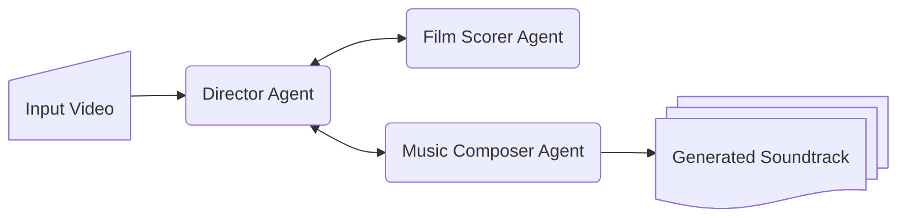

# Soundtrack Generator Agent

## Overview

This project provides an agent that generates a soundtrack for an input video.  The agent takes the content and mood of the video into consideration, and leverages music generation using Lyria 2 to create a relevant audio overlay for the video.  This sample demostrates ADK development with TypeScript, multi-agent interaction, tools, and using Google Gen AI SDK.  The output is saved on the user's local disk.

## Agent Details

| Feature              | Description                |
| -------------------- | -------------------------- |
| **Interaction Type** | Pipeline                   |
| **Complexity**       | Medium                     |
| **Agent Type**       | Multiple Agents            |
| **Components**       | `LlmAgent`, `FunctionTool` |
| **Vertical**         | Media & Entertainment      |

### Agent Architecture


### Key Features
- **Developed with adk-js:** Provides a simple example of an ADK agent written in TypeScript
- **Multi-agent Flow:** Agent interaction involving an orchestrator and several sub-agents
- **Tool using Google Gen AI SDK:** Demonstrates the usage of Lyria 2 via Google Gen AI SDK 
- **Simple I/O:** Uses local disk for input context, and for saving the generated soundtrack asset

## Setup and Installation

### Prerequisites

- Node.js 24.13.0 or later
- Node Package Manager (npm) 11.8.0 or later
- Google Cloud Project with Vertex AI enabled (highly preferred)

### Installation

1.  **Navigate to the project directory**:
    ```bash
    cd soundtrack-generator-agent
    ```

2.  **Install dependencies**:
    ```bash
    npm install
    ```

3.  **Set up configuration variables**:

    This project requires Google Cloud credentials.  Refer to [ADK documentation](https://google.github.io/adk-docs/get-started/quickstart/#set-up-the-model) for more details on setting up authentication.
    
    Also, take a peek at `config.ts` to understand how configuration variables are defined.

## Running the Agent

Use `npx adk` to interact with the agent via CLI.

**Run the following command to launch the dev UI**:

```bash
npx adk web
```

Refer to [ADK documentation](https://google.github.io/adk-docs/get-started/quickstart/#run-your-agent) for more details on running agents.
